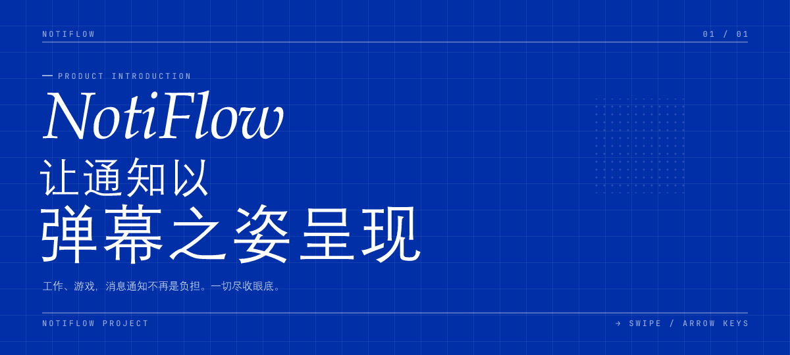
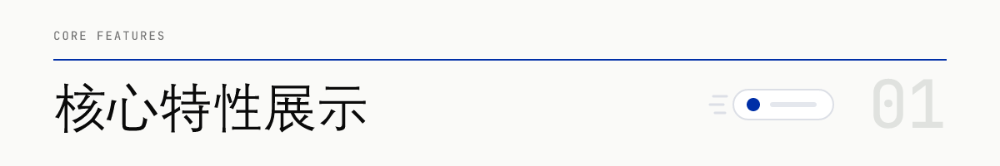
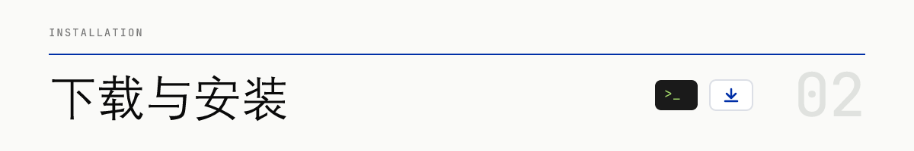

<div align="center">
  

  <p>
    <b>在Windows端上实现“弹幕通知”功能</b>
  </p>

  <!-- 徽章区 -->
  <p>
    <a href="https://github.com/Oatizen/NotiFlow/releases"></a>
    
    
    <a href="LICENSE"></a>
  </p>
</div>

<br/>

> 打团听到消息提示，不想立即查看但又担心错过重要通知？
> **NotiFlow** 可以拦截 Windows 原生通知或是邮箱邮件，并将其转化为全透明、鼠标穿透的“弹幕”从屏幕上方飘过。**工作、游戏，消息通知不再是负担。一切尽收眼底。**

https://github.com/user-attachments/assets/d6c6ac91-e404-48e4-8109-85fa61497eff

<br/>

<div align="center">
  
</div>

- 🖱️ **鼠标穿透**：弹幕处于置顶状态，但鼠标点击会直接穿透到下层游戏/网页，避免干扰操作。
- ⚡ **硬件性能0负担**：接入 `Windows.UI.Composition API`，弹幕由GPU直接渲染，最大化保留设备性能，不干扰工作娱乐。
- 🎨 **丰富的自定义选项**：共19种自定义选项，字体、字号、文字颜色、透明度、弹幕速度乃至弹幕最大长度，弹幕的每一部分皆可单独自定义样式，更可上传图片作为弹幕背景、挂件，自定义独属于你的弹幕样式。
- 🎯 **作用域设置**：在哪些界面上方显示弹幕，显示哪些应用的通知，各自情景显示的弹幕是何种样式，NotiFlow都可自定义，设置更自由。
- 🛡️ **防截图保护**：采用 `DisplayAffinity` 技术，只需开启设置开关，使用系统截图或 OBS 等软件录屏时，弹幕会在捕捉画面中自动隐藏，保护隐私。
- ⌨️ **多显示器支持**：支持多显示器设置，可自由选择NotiFlow在哪些显示器工作，更可实现弹幕跨显示器流转。
- ⚙️ **开机自启**：可自定义是否开机自启，无需每次手动启动。
- 📩 **绑定邮箱**：可接入邮箱以接收邮件并转化为弹幕通知，增加工作效率。

---

<br/>

<div align="center">
  
</div>

### 方式一：【首选推荐】微软商店版本
通过微软商店安装是获取 NotiFlow 最简单、最安全的方式。
- **🌐 通过网页版商店**：点击进入 [NotiFlow 微软商店网页](https://apps.microsoft.com/detail/9PGZ5PVTMG0P?hl=zh-cn&gl=CN&ocid=pdpshare)，点击`在Microsoft Store中查看`跳转至微软商店，再点击`安装`，安装完毕后点击`打开`。
- **🚀 使用引导安装包**：前往 Releases 页面（[GitHub](https://github.com/Oatizen/NotiFlow/releases) 或 [Gitee](https://gitee.com/Oatizen/NotiFlow/releases)）下载并运行 `NotiFlow_Store_Installer.exe`，将自动唤起微软商店安装最新版本。
- **🔍 手动搜索**：打开系统自带的`Microsoft Store`，搜索`NotiFlow`进入商店页面，点击`安装`，安装完毕后点击`打开`。

### 方式二：免安装绿色版
1. 前往 Releases 页面（[GitHub](https://github.com/Oatizen/NotiFlow/releases) 或 [Gitee](https://gitee.com/Oatizen/NotiFlow/releases)）下载最新版本附件中的 `NotiFlow-vX.X.X-Standalone.exe`。
2. 下载完毕后直接双击运行 `NotiFlow-vX.X.X-Standalone.exe`（内置所需环境，开箱即用）。
3. 在桌面右下角系统托盘中找到 NotiFlow 图标，左键单击或通过右键菜单进入“设置”界面。

### 方式三：便携版
便携版安装包更小但不含应用运行所必需的运行环境，你需要先在设备上安装`.NET 桌面运行时`才能够使用NotiFlow。
1. 前往[.NET 运行时官网](https://dotnet.microsoft.com/download/dotnet/8.0)中点击最新版本的`.NET 桌面运行时 8.0.X`下方`安装程序`中的`x64`。（注：不是“ASP.NET Core 运行时”、“.NET 运行时”、“SDK”或是“x86,x64,winget指令”版的“.NET桌面运行时”）
2. 下载完毕后打开`windowsdesktop-runtime-8.0.X-win-x64.exe`,点击`安装`并等待安装完成。
3. 前往 Releases 页面（[GitHub](https://github.com/Oatizen/NotiFlow/releases) 或 [Gitee](https://gitee.com/Oatizen/NotiFlow/releases)）下载最新版本附件中的 `NotiFlow-vX.X.X-Portable.exe`。
4. 下载完毕后直接双击运行 `NotiFlow-vX.X.X-Portable.exe`。（若无法运行，请检查是否已正确下载.NET 桌面运行时）
5. 在桌面右下角系统托盘中找到 NotiFlow 图标，左键单击或通过右键菜单进入“设置”界面。

*注：弹幕不支持在以全屏模式运行的程序上方显示，请尝试使用无边框窗口模式*
- ❓为什么不会显示我的微信通知？
由于微信PC版客户端的通知推送不经过Windows通知中心，因此无法被NotiFlow读取和显示。这并非NotiFlow的问题。

---

## 🛠️ 从源码构建 (开发者指南)

如果你想自己修改代码或为本项目贡献功能，请参考以下指南：

### 环境依赖
- [Visual Studio 2022](https://visualstudio.microsoft.com/) (包含 .NET 桌面开发工作负载)
- .NET 8.0 SDK

### 快速编译
```bash
# 克隆仓库
git clone https://github.com/Oatizen/NotiFlow.git

# 进入目录
cd NotiFlow

# 运行项目
dotnet run